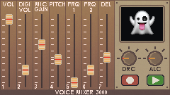

# Voice Mixer 3000

A voice recording and real-time effects processor for the **M5Cardputer-Adv**, built on the ESP32-S3. Record up to 60 seconds of audio to a MicroSD card, then play it back with 7 different voice effects, pitch shifting, ring modulation, delay, and full analog/digital signal chain control — all from the built-in keyboard.



---

## Features

- **60-second voice recording** stored as a 16-bit mono WAV file on MicroSD
- **7 voice effects**: Robot, Ghost, Alien, Radio, Chipmunk, Villain, Cave
- **Pitch shifting** from -6 to +10 semitone steps
- **Ring modulation** with two independent carrier frequencies (Freq1: 0–200 Hz, Freq2: 0–15 Hz)
- **Delay/reverb** up to 1000 ms
- **Streaming audio architecture** — effects are processed chunk-by-chunk (~256 samples), keeping peak RAM usage around 30–40 KB instead of loading the entire recording into memory
- **Soft limiter** on playback to prevent speaker distortion at high digital volume
- **Hardware ALC** (Automatic Level Control) on the mic input — 3 speed modes
- **Hardware DRC** (Dynamic Range Compression) on the DAC output — up to NUKE brick-limiter mode
- **Signal conditioning on recording**: slew limiter → IIR high-pass filter (removes DC/rumble) → soft limiter
- **Button-click suppression**: 80 ms trim from the end of recordings, 80 ms delayed mic arm on start
- **Battery monitor** with charge detection and color-coded voltage readout
- **3-page in-device help screen** (press `DEL`, `SPACE`, or modifier keys)
- **Custom bitmap UI** with per-control sliders, rotary knobs, and effect sprites — all rendered directly from PROGMEM

---

## Hardware

| Component | Part |
|---|---|
| Main board | M5Cardputer-Adv (ESP32-S3) |
| Audio codec | ES8311 |
| Keyboard controller | TCA8418 |
| Display | ST7789 135×240 TFT (SPI) |
| Storage | MicroSD card (SPI, GPIO 12/14/39/40) |
| I2S bus | GPIO 41 (SCLK), 43 (LRCK), 42 (DOUT), 46 (DIN) |
| I2C bus | GPIO 8 (SDA), 9 (SCL) @ 400 kHz |
| Battery ADC | GPIO 10 (100k/100k voltage divider) |

---

## Dependencies

Install these libraries via the Arduino Library Manager or manually:

- [LovyanGFX](https://github.com/lovyan03/LovyanGFX) — display driver
- Arduino ESP32 core with `driver/i2s.h` (built-in)
- `SD.h`, `SPI.h`, `Wire.h` (built-in with ESP32 Arduino core)

No third-party audio or effects libraries are used. Everything in `ES8311Audio`, `VoiceEffects`, and `WavRecorder` is implemented from scratch.

---

## Building & Flashing

1. Install the **ESP32 Arduino core** (board: `ESP32S3 Dev Module` or equivalent M5Stack board)
2. Set **PSRAM**: `OPI PSRAM` (present but not required — streaming FX works without it)
3. Set **Partition scheme**: large app / 16 MB flash as appropriate for your board
4. Place all `.ino`, `.h`, and `.cpp` files in the same sketch folder
5. The bitmap header files (`VM3000_*.h`) contain PROGMEM image data — they are large but compile fine
6. Flash and open Serial Monitor at 115200 baud

---

## File Structure

```
VoiceMixer3000/
├── VoiceMixer3000.ino      # Main sketch: UI, input handling, playback pipeline
├── ES8311Audio.h/.cpp      # ES8311 codec driver (I2C register-level)
├── WavRecorder.h/.cpp      # SD card recording & playback, I2S management
├── VoiceEffects.h/.cpp     # Streaming audio effects engine
├── CardputerKeyboard.h/.cpp # TCA8418 keyboard driver
├── Display.h               # LovyanGFX panel config for ST7789
├── VM3000_background.h     # Full-screen background bitmap (PROGMEM)
├── VM3000_sprites.h        # Record/Play button sprites (27×18 px)
├── VM3000_effects.h        # Effect icon sprites (59×48 px)
├── VM3000_slider.h         # Slider track and knob bitmaps
├── VM3000_knobs.h          # DRC/ALC rotary knob sprites (34×28 px)
└── images/
    └── GUI.png
```

---

## Controls

### Transport

| Key | Action |
|---|---|
| `FN` (release) | Start recording |
| `FN` (press) | Stop recording |
| `OK` | Play / Stop playback |

### Sliders (letter = down, number = up)

| Keys | Parameter | Range |
|---|---|---|
| `Q` / `1` | DAC volume | 0 – 100% |
| `W` / `2` | Digital volume (pre-limiter gain) | 1× – 10× |
| `E` / `3` | Mic PGA gain | 0 – 30 dB (3 dB steps) |
| `R` / `4` | Pitch shift | -6 – +10 semitones |
| `T` / `5` | Ring mod Freq 1 | 0 – 200 Hz |
| `Y` / `6` | Ring mod Freq 2 | 0 – 15 Hz |
| `U` / `7` | Delay | 0 – 1000 ms |

### Modes

| Key | Action |
|---|---|
| `0` | Cycle voice effect (None → Robot → Ghost → Alien → Radio → Chipmunk → Villain → Cave → None) |
| `-` | Cycle DRC mode (Off → Med → Hard → Crush → NUKE) |
| `+` | Cycle ALC mode (Off → Low → Mid → High) |

### Display

| Key | Action |
|---|---|
| `B` | Brightness up |
| `V` | Brightness down |
| `DEL` / `SPACE` / modifiers | Open help screen |
| `,` / `/` | Previous / next help page |

---

## Voice Effects

| Effect | Description |
|---|---|
| **None** | Clean playback with optional pitch, ring mod, and delay |
| **Robot** | Vocoder-style ring modulation for a robotic voice |
| **Ghost** | Pitch shifted down with heavy reverb |
| **Alien** | LFO-modulated pitch with strange resonances |
| **Radio** | Bandpass filtered to simulate an AM radio |
| **Chipmunk** | Pitched up, faster playback |
| **Villain** | Pitched down with deep reverb |
| **Cave** | Long Schroeder reverb with four comb filters and two allpass stages |

---

## Audio Signal Chain

### Recording
```
Microphone → ES8311 PGA (0–30 dB) → ES8311 ADC → I2S RX
→ [Slew limiter → IIR High-pass filter → Soft limiter] → SD card WAV
```

### Playback (with effects)
```
SD card WAV → processChunk() in VoiceEffects
→ [Pitch resampler] → [Effect DSP] → [Ring mod] → [Delay]
→ Digital soft limiter (digiVolume) → I2S TX → ES8311 DAC → Speaker
```

---

## ES8311 Register Notes

The `ES8311Audio` driver talks directly to the codec over I2C. Key registers:

- `0x14` — PGA gain (mic amplifier, 3 dB steps)
- `0x17` — ADC digital volume
- `0x18–0x19` — ALC enable, window size, target level
- `0x32` — DAC digital volume
- `0x34–0x35` — DRC enable, window size, target level

> ⚠️ **Note for other ES8311 users**: `0x33` is `DAC_OFFSET`, **not** DRC. DRC enable is at `0x34` bit 7. This is a common mistake in third-party drivers.

---

## SD Card Notes

- Recordings are saved to `/VoiceMemos/current.wav` and overwrite on each new recording
- The file is a standard 16-bit mono PCM WAV at 16 kHz
- Card must be FAT32 formatted
- Recording stops automatically at 60 seconds

---

## License

MIT License. See [LICENSE](LICENSE) for details.
